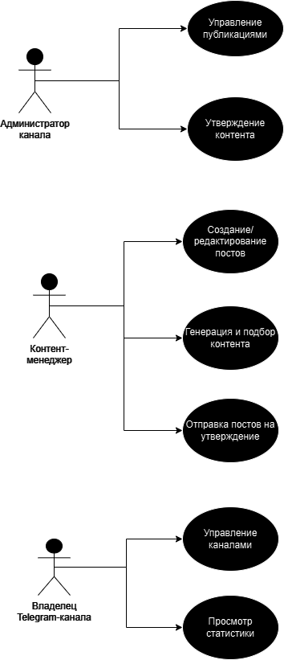

### Выполненное задание

#### 1. **Стейкхолдеры**

1. **Владельцы Telegram-каналов**  
   Заинтересованы в увеличении аудитории, оптимизации контентного плана и управлении несколькими каналами.

2. **Администраторы Telegram-каналов**  
   Утверждают и публикуют контент на различных Telegram-каналах. 

3. **Контент-менеджеры**  
   Создают и редактируют контент на различных Telegram-каналах.

4. **Разработчики системы**  
   Отвечают за разработку, тестирование и поддержку программной системы.

---

#### 2. **Функциональные требования**

1. **Управление публикациями**
   - Создание, редактирование и удаление постов.
   - Настройка расписания для автопостинга.

2. **Управление каналами**
   - Добавление и удаление Telegram-каналов.
   - Переключение между каналами для управления.

3. **Автоматизация**
   - Автопостинг контента по расписанию.
   - Автоудаление постов через заданное время.
   - Повторная публикация ранее опубликованных постов.

4. **Генерация контента**
   - Импорт контента из других Telegram-каналов.
   - Генерация рекомендаций на основе популярности и предпочтений.

5. **Процесс утверждения контента**
   - Настройка ролей и прав для пользователей системы.
   - Возможность отправки контента на утверждение перед публикацией.

---

#### 3. **Диаграмма вариантов использования**

---

#### 4. **Перечень сделанных предположений**

1. Для работы системы будут использоваться официальные возможности Telegram API.
2. Пользователь должен заранее предоставить ключи от API личного бота.
3. Возможность добавления аналитики или работы с метриками вовлечённости.
4. Процесс утверждения контента может быть упрощен для малых команд (1-2 человека).

---

#### 5. **Нефункциональные требования**

1. **Безопасность**  
   - Все данные, передаваемые через API, должны быть зашифрованы (использование HTTPS и OAuth).
   - Механизм разграничения прав доступа для ролей и пользователей.
   - Хранение телеграм токенов при помощи менеджера секретов (Hashicorp Vault)

2. **Кроссплатформенность**  
   - Поддержка мобильных(telegram mini app) и веб-версий интерфейса.

