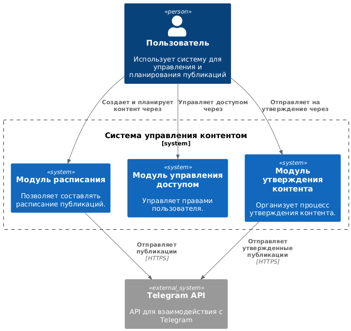
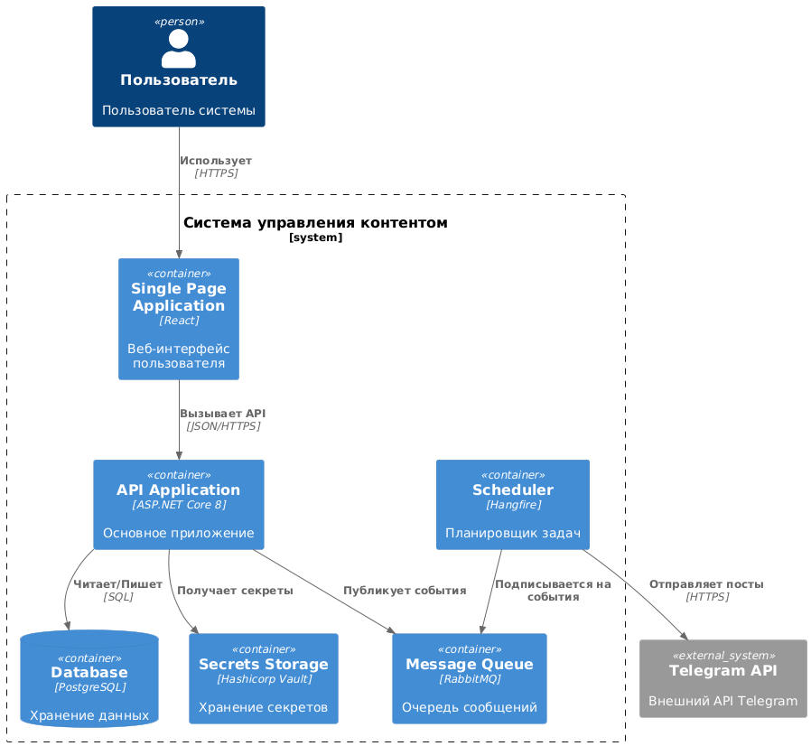
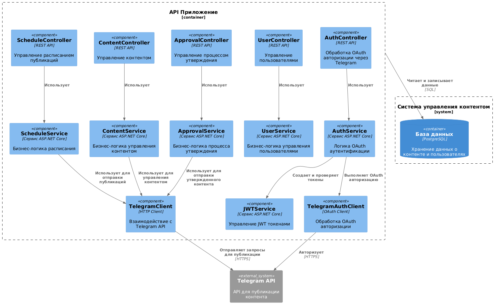

## Диаграмма контекста

## Диаграмма контейнеров

В качестве архитектурного стиля выбрана модульная монолитная архитектура. Этот подход позволяет разделить ответственность на отдельные модули внутри единого развертываемого приложения

## Диаграмма компонентов API

